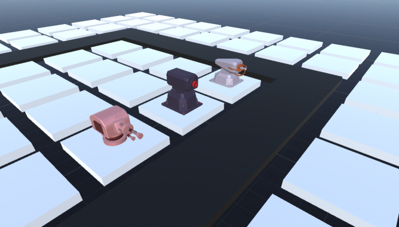
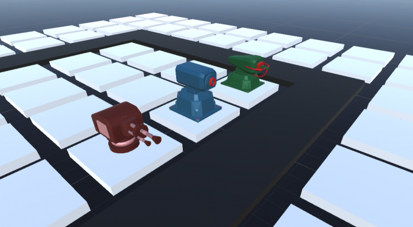
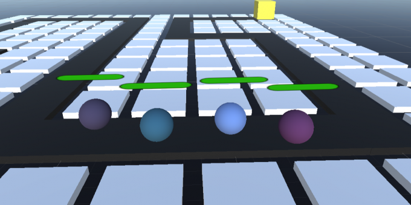
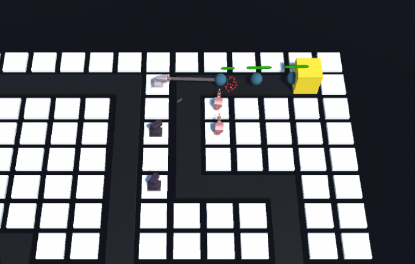
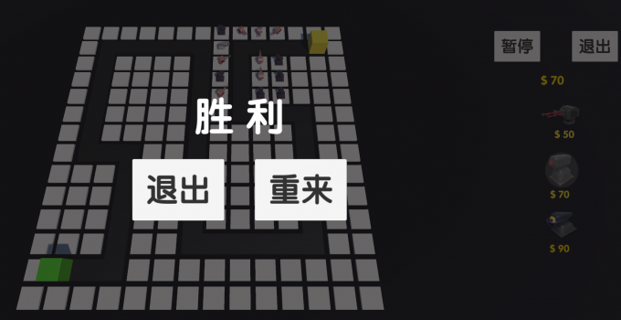
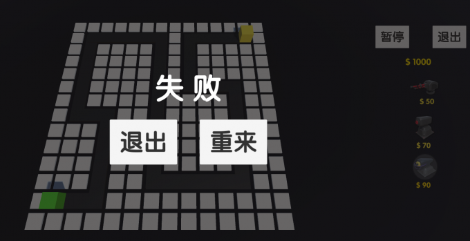
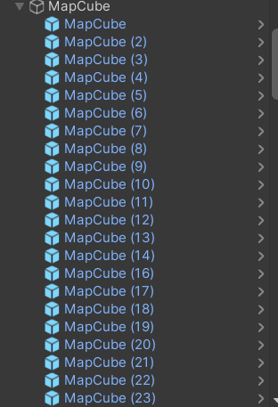
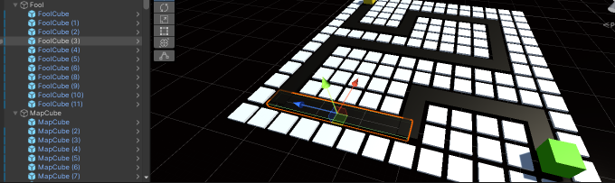
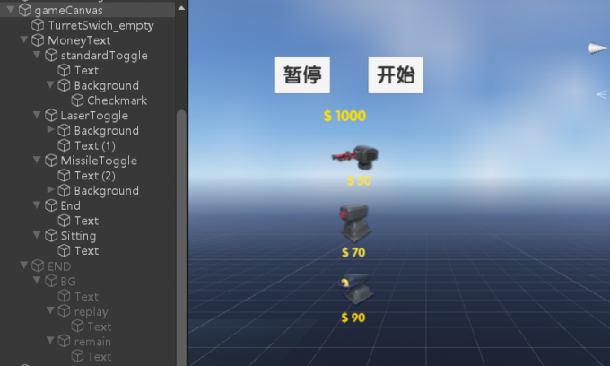
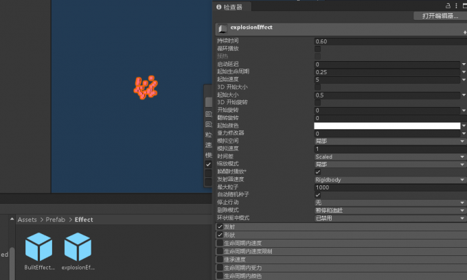

# 项目介绍

本次实践的题目是“基于unity的塔防游戏开发”。该游戏设计是我们对于本课程游戏设计与开发的实践与应用。利用在unity相关课程中学到的知识完成了对本项目的开发，有效的提升了我们对于unity以及c#相关知识的巩固与复习，在实践中提升了我们对于知识的理解，锻炼了我们的实际开发能力和编码技术。

受我们在生活中的手机小游戏，当年风靡全国的“保卫萝卜”的启发，我们设计并开发了这款塔防小游戏，基于现在人们的高压快速的生活节奏，在下班时间，人们需要一款并不是很需要动脑和浪费时间的小游戏来发泄一下在工作中的郁闷。所以我们设计了这款简约风格的塔防小游戏，没有当今市面上的塔防游戏的那种眼花缭乱的特效，有着90年代街机游戏的风格特色，可以让玩家找到当年打游戏的那种感觉。

# 游戏设计
## 游戏控制方式

在游戏地图中存在起始点与终点，敌人分为蓝，紫，粉，红四批，会从起始点产生出发前往终点，每一批的敌人都比前一批的数量和血量要多，当一批敌人死光了，才会出来第二批敌人，游戏一共有三种炮塔，玩家需要通过在地图上建造与升级炮塔，来阻止游戏中敌人到达终点。

## 游戏角色设计

游戏内共有3种炮塔，每种炮塔均可升级与拆除，炮塔只能升级一次，炮塔升级后将会改变外观与伤害，属性如下

|   | 伤害值  | 升级后伤害值  | 建造费用  | 拆除费用  |
| ------------ | ------------ | ------------ |------------ |------------ |
| 普通炮塔standard  | 50  | 70  | 50  | 50  |
| 导弹炮塔Missile  | 70  |  90 | 70  | 50  |
| 激光炮塔Laser  |  100 | 120  |  90 | 50  |

升级前



升级后


共有4种敌人，每种敌人上方都有血量条实时显示当前血量，属性如下

|   | Enemy1  |  Enemy2 |  Enemy3 |  Enemy4 |
| ------------ | ------------ | ------------ | ------------ | ------------ |
| HP |  200 | 300  | 400  | 500  |
| 移动速度  |  12 |  12 |  10 | 10  |



## 游戏关卡设计

游戏一开始会给予玩家1000的金钱，通过在敌人前进道路上放置炮塔攻击消灭敌人，放置炮塔的同时金钱会随之减少，只有拥有足够的金钱才能购买并放置炮塔，将炮塔拆除后会得到相应的拆除费用，将全部敌人消灭之后通关游戏





游戏将会产生4波敌人，第一波15个敌人，第二波15个敌人，第三波20个敌人，第四波20个敌人。敌人数量依次增加，强度依次增强，只有将本波敌人全部消灭之后下一波敌人才会产生，当敌人到达终点时游戏失败，可以选择退出游戏与重新开始。


# 游戏实现
## 游戏场景

**Cube创建基本的地图**
    创建一个空物体记作"MapCube"，把与地图map相关的都放进去，创建一个cube,进行ctrl+d复制，按住ctrl进行拖拽



    然后选择两个点作为起始点和终点，随机连起来，选择一些个MapCube删除掉，然后在空的路上边还是用Cube（Road纯黑材质）连出这条路来
    将敌人走的路径放到一个新建的"RoadCube"



## 游戏主要功能点
创建炮台
```csharp
    public void BuildTurret(TurretData turretData)
    {
        this.turretData = turretData;
        isUpgraded = false;

        //在鼠标点击的cube上创建炮塔
        turretGo = GameObject.Instantiate(turretData.turretPrefab, transform.position, Quaternion.identity);

        //创建炮塔时触发粒子效果
        GameObject effect = GameObject.Instantiate(buildEffect, transform.position, Quaternion.identity);

        Destroy(effect, 1.5f);
    }
```
升级炮台
```csharp
    public void UpgradeTurret()
    {
        if (isUpgraded == true) return;   //升级标记
        Destroy(turretGo);   //销毁之前的炮塔
        isUpgraded = true;
        turretGo = GameObject.Instantiate(turretData.turretUpgradedPrefab, transform.position, Quaternion.identity);
        GameObject effect = GameObject.Instantiate(buildEffect, transform.position, Quaternion.identity);
        Destroy(effect, 1.5f);
    }
```
销毁炮台
```csharp
    public void DestroyTurret()
    {
        Destroy(turretGo);
        isUpgraded = false;
        turretGo = null;   //cube上为空
        turretData = null;
        GameObject effect = GameObject.Instantiate(buildEffect, transform.position, Quaternion.identity);
        Destroy(effect, 1.5f);
    }
```
# 游戏涉及的知识点（需要包括所有学习的知识点）

## 物理系统
**子弹与敌人的碰撞处理，让子弹碰到敌人就爆炸**
在Bullet预制体上添加一个Rigidbody刚体，取消勾选Use Gravity，在Bullet中处理触发检测OnTriggerEnter方法，定义好爆炸的特效字段explosionEffectPrefab，在Enemy中添加TakeDamage方法表示受到了伤害，Enemy脚本全部代码如下：
```csharp
    public class Enemy : MonoBehaviour
    {

        public float speed = 10;   //移动的速度
        public float hp = 150;  //敌人的血量
        private float totalHp;   //血量的变化
        public GameObject explosionEffect;   //敌人死亡的特效
        private Slider hpSlider;    //ui中的Slider组件
        private Transform[] positions;    //获取之前做好的路径数组
        private int index = 0;   //数组下标
       // private BuildManager money;

        // Use this for initialization
        void Start()
        {
            positions = Waypoints.positions;
            totalHp = hp;   //一开始变化的血量等于敌人的血量
            hpSlider = GetComponentInChildren<Slider>();  //获得敌人身上的ui中的Slider组件 显示血量的减少
        }

        // Update is called once per frame
        void Update()
        {
            Move();
        }

        //控制敌人的移动
        void Move()
        {
            if (index > positions.Length - 1)    //到达目的点
            return;

            //（目标位置 - 当前位置）（单位向量）
            transform.Translate((positions[index].position - transform.position).normalized * Time.deltaTime * speed);
        
            //判断两个点之间的距离
            if (Vector3.Distance(positions[index].position, transform.position) < 0.2f)
            {
                index++;
            }

            if (index > positions.Length - 1)   //到达终点
            {
                ReachDestination();   //调用销毁函数
            }
        }

        //达到终点时销毁
        void ReachDestination()
        {
            GameManager.Instance.Failed();
            GameObject.Destroy(this.gameObject);
        }

        //被炮塔攻击时敌人存活数量减1
        void OnDestroy()
        {
            EnemySpawner.CountEnemyAlive--;
            //money.ChangeMoney(100);

        }

        //敌人受到伤害扣血
        public void TakeDamage(float damage)
        {
            if (hp <= 0) return;  
            hp -= damage;
            hpSlider.value = (float)hp / totalHp;

            if (hp <= 0)  //血量为0
            {
                Die();   //销毁函数
            }
        }

        //敌人销毁函数
        void Die()
        {
            GameObject effect = GameObject.Instantiate(explosionEffect, transform.position, transform.rotation);   //创建特效
            Destroy(effect, 1.5f);   //销毁特效
            Destroy(this.gameObject);   //销毁自身
        }

    }
```

## 数学基础

**敌人的移动**
```csharp
    //控制敌人的移动
    void Move()
    {
        if (index > positions.Length - 1)    //到达目的点
            return;
        //（目标位置 - 当前位置）（单位向量）
        transform.Translate((positions[index].position - transform.position).normalized * Time.deltaTime * speed);
        //判断两个点之间的距离
        if (Vector3.Distance(positions[index].position, transform.position) < 0.2f)
        {
            index++;
        }
        if (index > positions.Length - 1)   //到达终点
        {
            ReachDestination();   //调用销毁函数
        }
    }
```
**子弹跟踪敌人**
```csharp
    void Update()
    {
        if (target == null)   //子弹击打的目标为空
        {
            Die();   //调用销毁函数
            return;
        }
        transform.LookAt(target.position);   //子弹面向目标的位置
        transform.Translate(Vector3.forward * speed * Time.deltaTime);  //子弹移动

        Vector3 dir = target.position - transform.position;   //三维向量dir = 敌人的位置-当前子弹的位置
        if (dir.magnitude < distanceArriveTarget)    //dir.magnitude向量的长度
        {
            target.GetComponent<Enemy>().TakeDamage(damage);   //目标敌人扣血
            Die();   //调用 创建子弹爆炸的特效 销毁特效和子弹 函数
        }
    }
```
## UI系统

UI布局如下



**选择炮塔**

在gameCanvas下创建三个"Toggle"开关代表三种炮塔，BuildManager脚本进行监听是否被选择，再创建一个空物体TurretSwich_empty，并创建一ToggleGroup组件来包含这个三开关，
```csharp
    //监听Laser炮塔是否被选择
    public void OnLaserSelected(bool isOn)
    {
        if (isOn)   //isOn 表示被选择
        {
            selectedTurretData = laserTurretData;
        }
    }

    //监听Missile炮塔是否被选择
    public void OnMissileSelected(bool isOn)
    {
        if (isOn)
        {
            selectedTurretData = missileTurretData;
        }
    }

    //监听Standar炮塔是否被选择
    public void OnStandardSelected(bool isOn)
    {
        if (isOn)
        {
            selectedTurretData = standardTurretData;
        }
    }
```
**控制按钮——暂停/退出**

在gameCanvas下创建一个空物体命名为Sitting和End，各创建一个Text文本，将CanvasSitting脚本挂载到画布上,对应的游戏对象拖拽到代码公开变量上
```csharp
    //暂停和继续游戏
    public void ControlTime()
    {
        //如果点击了
        if (BtnState)
        {
            BtnState = false;
            BtnTitle.text = "暂停";
            //将时间设置为0,画面会停止运动,慢动作可以设置为0.5f
            Time.timeScale = 1f;
        }
        else
        {
            BtnState = true;
            BtnTitle.text = "继续";
            //将时间设置为0,画面会停止运动,慢动作可以设置为0.5f
            Time.timeScale = 0f;
        }
    }

    //开始/退出游戏
    public void OnExitGame()
    {
        if (BtnState1)
        {
#if UNITY_EDITOR
                UnityEditor.EditorApplication.isPlaying = false;
#else
            Application.Quit();
#endif
        }
        else
        {
            BtnState1 = true;
            BtnTitle1.text = "退出";
            //将时间设置为0,画面会停止运动,慢动作可以设置为0.5f
            Time.timeScale = 1f;
        }
    }
```
## 动画系统

**子弹爆炸特效**

创建名为ExplosionEffect特效，为Bullet预制体添加ExplosionEffect特效，在Bullet中处理触发检测OnTriggerEnter方法，在Enemy脚本中添加TakeDamage方法表示受到了伤害，使得子弹碰到敌人就爆炸


**敌人血条显示**

血条为Slider组件，通过Enemy脚本控制
```csharp
    void Start()
    {
        positions = Waypoints.positions;
        totalHp = hp;   //一开始变化的血量等于敌人的血量
        hpSlider = GetComponentInChildren<Slider>();  //获得敌人身上的ui中的Slider组件 显示血量的减少
    }
    //敌人受到伤害扣血
    public void TakeDamage(float damage)
    {
        if (hp <= 0) return;  
        hp -= damage;
        hpSlider.value = (float)hp / totalHp;

        if (hp <= 0)  //血量为0
        {
            Die();   //销毁函数
        }
    }
```
## 资源管理

## 数据保存和加载

**金钱的管理**

在gameCanvas下创建MoneyText，在BuildManager脚本中加入方法ChangeMoney和字段money
```csharp
    //游戏更新
    void Update()
    {
        if (Input.GetMouseButtonDown(0))  //如果鼠标按下（0按下  1弹起）
        {
            if (EventSystem.current.IsPointerOverGameObject() == false)  //鼠标是否按在UI上
            {
                //开发炮台的建造  鼠标点击mapcube
                Ray ray = Camera.main.ScreenPointToRay(Input.mousePosition);  //射线检测 鼠标的点转换为射线
                RaycastHit hit;   //射线检测目标
                //1000代表距离  LayerMask.GetMask("MapCube") layer层中的MapCube层
                bool isCollider = Physics.Raycast(ray, out hit, 1000, LayerMask.GetMask("MapCube"));
                if (isCollider)  //isCollider判断鼠标是否与mapcube发生碰撞
                {
                    MapCube mapCube = hit.collider.GetComponent<MapCube>();   //获得mapcube管理类
                    if (selectedTurretData != null && mapCube.turretGo == null)  //如果选择了炮塔 并且cube上没有炮塔才可以创建炮塔
                    {
                        if (money > selectedTurretData.cost)  //资金大于炮塔的价格 说明可以创建炮塔
                        {
                            ChangeMoney(-selectedTurretData.cost);   //减去炮塔的价格
                            mapCube.BuildTurret(selectedTurretData);   //创建炮塔
                        }
                        else   //不可以创建炮塔
                        {
                            moneyAnimator.SetTrigger("Flicker");  //播资金闪烁的动画 提示钱不够
                        }
                    }
                    else if (mapCube.turretGo != null)
                    {
                        // 升级处理
                        ShowUpgradeUI(mapCube.transform.position, mapCube.isUpgraded);
                        if (mapCube == selectedMapCube && upgradeCanvas.activeInHierarchy)   //当前点击的cube上已有炮塔 并且已经升级过了
                        {
                            StartCoroutine(HideUpgradeUI());   //再点击一次cube就隐藏升级拆除面板
                        }
                        else
                        {
                            ShowUpgradeUI(mapCube.transform.position, mapCube.isUpgraded);
                        }
                        selectedMapCube = mapCube;   //当前点击的cube等于之前保存炮塔的cube
                    }
                }
            }
        }
    }
    //资金的管理
    public void ChangeMoney(int change = 0)
    {
        money += change;   //change改变的值
        moneyText.text = "$ " + money;   //显示文本
    }
```
**炮塔的数据类**

创建炮台数据类，用来保存炮台相关数据，创建脚本TurretData
```csharp
//炮塔数据类（类型 价格）
[System.Serializable]    //可序列化
public class TurretData
{
    public GameObject turretPrefab;   //炮台的预制体
    public int cost;    //炮塔的价格
    public GameObject turretUpgradedPrefab;   //升级后的炮塔预制体
    public int costUpgraded;   //升级炮塔的价格
    public TurretType type;   //炮塔的类型
}
//枚举类型
public enum TurretType
{
    //三种炮塔的类型
    LaserTurret,
    MissileTurret,
    StandardTurret
}
```
